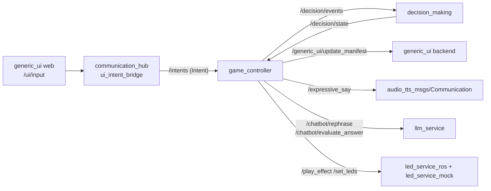

# CLAUDE.md

This file provides guidance to Claude Code (claude.ai/code) when working with code in this repository.

## Project Overview

ROS2 game controller system for EmorobCare therapeutic robot games. Orchestrates educational games for children by coordinating between:
- **decision_making**: External FSM that owns game logic and state transitions
- **generic_ui**: React-based UI shell for visual presentation
- **communication_hub**: Robot expressions (TTS, facial expressions, motions, LEDs)

## Commands

### Run Full System (Docker)
```bash
docker compose up --build
```

### Testing
```bash
# All tests are run via Docker
docker compose -f docker-compose.tests.yml up --build --abort-on-container-exit

# E2E tests (Docker)
docker compose -f docker-compose.e2e.yml up --build --abort-on-container-exit
```

### Run Node Directly (requires ROS2 Humble)
```bash
ros2 launch game_controller game_controller.launch.py
```

## Architecture

### Data Flow


1. User selection on `/game/user_selector` and `/game/game_selector`
2. `game_controller` loads game YAML/JSON and publishes `GAME_INIT` to `/decision/events`
3. `decision_making` publishes states to `/decision/state`
4. `game_controller` patches UI via `/generic_ui/update_manifest`
5. UI interactions are translated by `communication_hub` from `/ui/input` to `/intents`
6. `game_controller` publishes `USER_INTENT` or `GAME_CONTROL` based on current phase/state

### Key Design Rules
- **transactionId gates progression**: Every `/decision/state` has a `transactionId`. Events must reference current transaction or FSM ignores them.
- **Auto-advance is per transaction**: Timers are keyed by transactionId to prevent duplicates and avoid firing after user input.
- **Intents-only game input**: game_controller reacts to `/intents`, not directly to `/ui/input`.
- **UI input only forwarded in answerable states**: intents only forwarded in `WAIT_INPUT` and `FAIL_L1` states.

### Core Code Flow (read in order)
1. [node.py](game_controller/game_controller/node.py) - Main ROS2 node, callbacks, orchestration
2. [content/builder.py](game_controller/game_controller/content/builder.py) - GAME_INIT payload construction
3. [input_translation.py](game_controller/game_controller/input_translation.py) - Input translation and state gating
4. [auto_advance.py](game_controller/game_controller/auto_advance.py) - Timed ON_COMPLETE scheduling
5. [ui/manifest_builder.py](game_controller/game_controller/ui/manifest_builder.py) - UI manifest patches
6. [ui/manifest_client.py](game_controller/game_controller/ui/manifest_client.py) - UpdateManifest service wrapper

### ROS2 Topics
| Topic | Direction | Purpose |
|-------|-----------|---------|
| `/decision/state` | Subscribe | Game state updates (JSON) |
| `/decision/events` | Publish | FSM events: GAME_INIT, USER_INTENT, ON_COMPLETE, GAME_CONTROL |
| `/intents` | Subscribe | Normalized intents from `communication_hub` |
| `/game/game_selector` | Subscribe | Game selection (slug) |
| `/game/user_selector` | Subscribe | User selection |
| `/game/current_user` | Publish | Active user |

## Game Content

Games are defined in `game_controller/games/*.json`. Each game specifies:
- `slug`, `title`, `intro`
- `supportedPhases`: Which phase types (P1-P7) the game uses
- `phaseConfig`: Phase-specific prompts and settings
- `difficulties`: Options count per difficulty level (basic=2, intermediate=3, advanced=4)
- `answerType`: References answer set in `games/answers/`

### Phase Types
- **P1**: Matching/Association
- **P2**: Voice/Repetition
- **P3**: Discrimination (touch/voice)
- **P4_YESNO**: Yes/No questions (asks incorrect first, then correct)
- **P6**: Child asks "where is X", robot highlights and says "Aquííí"
- **P7**: Two-option choice ("¿Es un ... o ...?")

## External Dependencies

Sibling repositories required for Docker builds:
- `../generic_ui` - UI backend and React frontend
- `../refactored_game/decision_making_ws` - FSM

## Configuration

- ROS parameters: `game_controller/config/game_controller.yaml`
- Auto-advance timeouts, topic names, and game defaults are configurable
- communication_hub behaviors: `communication_hub/config/robot_behaviors.yaml`
