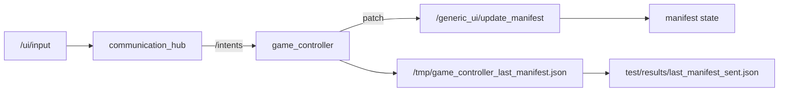

# Actual Runtime State Snapshot

Date: 2026-02-12
Stack: `game_controller/docker-compose.yml`

## Saved artifacts
- `game_controller/test/results/actual_compose_ps.txt`
- `game_controller/test/results/actual_decision_state.txt`
- `game_controller/test/results/actual_manifest_response.txt`
- `game_controller/test/results/actual_runtime_logs_5m.txt`
- `game_controller/test/results/last_manifest_sent.json`

## Key observed state
- Decision state snapshot: `PAUSED` with `gameState=WAIT_INPUT`.
- Manifest snapshot (from `/generic_ui/get_manifest`) shows:
  - `instances[0].component = "GameComponent"`
  - `config.pause = true`
  - `config.controls.showResume = true`
  - `state.system = "PAUSED"`
- Logs show pause path end-to-end:
  - `communication_hub`: published `/intents` RAW_USER_INPUT with `PAUSE`
  - `game_controller`: received input from `/intents` and published `GAME_CONTROL`
  - `decision_making`: transitioned to `PAUSED`

## Notes
- Current compose path is intent-only for game answers/control:
  - UI emits `/ui/input`
  - `communication_hub` translates `/ui/input` to `/intents`
  - `game_controller` reacts to `/intents`
- Manifest snapshots are also persisted inside container at `/tmp/game_controller_last_manifest.json`.
- Runtime logs include explicit manifest update lines (`Sending manifest patch`, `Manifest patch applied`, `Manifest snapshot saved`).

